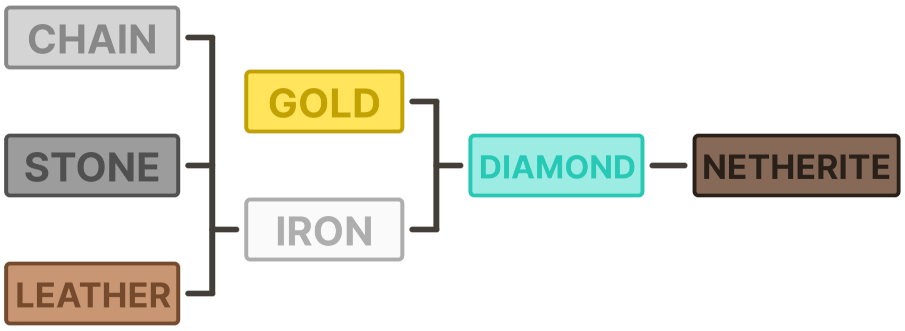

# **Receptury**
Część domyślnych receptur została zmodyfikowana na potrzebny balansu i dynamiki rozgrywki.

## **Wyposażenie**
Maksymalny poziom wyposażenia, jakie można wytworzyć w stole rzemieślniczym to **kamienny** (narzędzia) i **skórzany** (zbroje). Aby uzyskać lepsze wyposażenie, należy ulepszyć obecne korzystająć ze **stołu kowalskiego** i szablonów ulepszeń.

### Szablony Ulepszeń
Szablony ulepszeń można wytworzyć za pomocą poniższych receptur:

    
    
    

Układ jest dowolny, a zamiast <strong>Deepslate</strong> można też użyć <strong>Cobbled Deepslate</strong>.

Ulepszenia dowolnego narzędzia wymaga jednego szablonu, natomiast ulepszenie dowolnej części zbroji, wymaga już dwóch szablonów.

    
    

Podczas ulepszenia zachowywane są zaklęcia i inne parametry przedmiotów.

Poniższy wykres przedstawia ścieżkę ulepszenia dla każdego poziomu wyposażenia.

Tym samym można zauważyć, że złotego wyposażenia nie można zdobyć za pomocą ulepszeń. Jest ono unikalne i można je znaleźć tylko jako łup w strukturach.

## **Przetapianie**
Przetapianie w rud i pożywienia w **zwykłym piecu** jest **dwa razy wolniejsze**. Korzystaj z specjalistycznych stacji, aby zyskać na czasie i otrzymać więcej **punktów doświadczenia**.