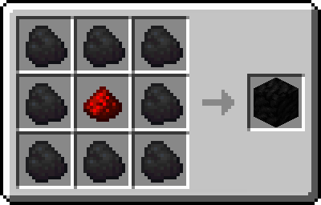
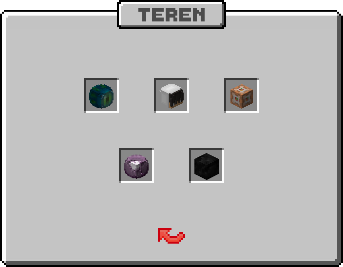

# **Chronione Tereny**
Chronione tereny to podstawa każdego publicznego serwera Minecraft. Pozwalają one ochronić budowle i przedmioty graczy przed nieporządanymi gośćmi. Nasza implementacja jest możliwie prosta i zarazem bogata w możliwości zarządzania.

### Blok Terenu
Terenem nazywany jest **chroniony obszar**, który powstaje poprzez postawienie **specjalnego bloku**.  

Podstawowy blok można wytworzyć za pomocą poniższej receptury:

Każdy gracz może postawić maksymalnie **pięć** terenów, a każdy z nich ma dodatkowo **pięć** poziomów ulepszeń.

### Panel Zarządzania
Panel zarządzania można otworzyć poprzez **interakcję** z blokiem terenu, lub za pomocą komendy **/claims**. Obecnie udostępnia on poniższe funkcje:
- Teleportacja na spawn, magnetyt lub inny teren.
- Dodanie i usunięcie graczy z terenu.
- Modyfikacja ustawień dotyczących środowiska terenu i interakcji ze znajdującymi się na nim blokami.
- Zmianę miejsca teleportu.
- Ulepszenie do następnego poziomu.

### Ulepszanie
Każdy teren może zostać ulepszony **pięć** razy. Aby postawić nowy teren, każdy poprzedni musi być ulepszony do maksymalnego poziomu.

- **Węgiel** ⟶ **Żelazo** 
  - Koszt: **16x Sztabka Żelaza**
  - Rozmiar: **41 x 41**
- **Żelazo** ⟶ **Złoto** 
  - Koszt: **16x Sztabka Złota**
  - Rozmiar: **51 x 51**
- **Złoto** ⟶ **Diament** 
  - Koszt: **16x Diament**
  - Rozmiar: **61 x 61**
- **Diament** ⟶ **Szmaragd** 
  - Koszt: **16x Szmaragd**
  - Rozmiar: **71 x 71**
- **Szmaragd** ⟶ **Netheryt** 
  - Koszt: **4x Sztabka Netherytu**
  - Rozmiar: **81 x 81**