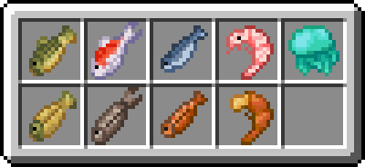

# **Dodatkowa Zawartość**
W tym miejscu znajdziesz informacje na temat nowych, dodanych przez nas przedmiotów.

### Przedmioty
Kilka nowych gatunków ryb możliwych do złowienia za pomocą wędki.

  
Część tekstur pochodzi z modyfikacji [Fishing101](https://github.com/Macck209/Fishing101).

### Zaklęcia
Kilka nowych zaklęć możliwych do uzyskania za pomocą stołu do zaklęć i znalezionych zaklętych książek.
- **Magnet** — Kilof  
  Wykopane minerały i złoża trafiają bezpośrednio do ekwipunku.  

- **Gravity** — Buty  
  Dodaje efekt pomniejszonej grawitacji, pozwalając tym samym na wyższy, ale wolniejszy skok.

- **Sonic Shield** — Tarcza  
  Pozwala ochronić się przed falą dźwiękową wardena.

- **Rejuvenation** — Tarcza  
  Zwiększa maksymalną ilość punktów życia.

- **Scholar of Blocks** — Kilof, Siekiera, Motyka  
  Wykopane bloki dają więcej punktów doświadczenia.

- **Scholar of Mobs** — Broń  
  Zabite moby dają więcej punktów doświadczenia.

- **Posion Aspect**  — Broń  
  Uderzona ofiara otrzymuje efekt trucizny.

- **Slowness Aspect** — Broń  
  Uderzona ofiara otrzymuje efekt spowolnienia.

- **Weakness Aspect** — Broń  
  Uderzona ofiara otrzymuje efekt osłabienia.

- **Wither Aspect** — Broń  
  Uderzona ofiara otrzymuje efekt obumierania.

Część zaklęć pochodzi z modyfikacji [Enchantments Encore](https://github.com/NiceKaleido/Enchantments-Encore).
